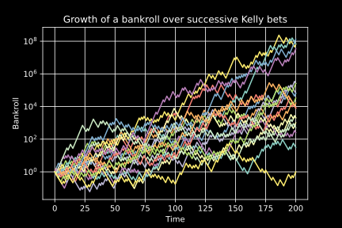

# Kelly criterion



- [Aaron Brown](https://www.eraider.com/articles.php)
    - [When Harry Met Kelly](https://storage.googleapis.com/wzukusers/user-28782334/documents/595d025ef24eeXOj3NY2/When%20Harry%20Met%20Kelly%20201103.pdf)
    - [Kelly Myths and Heros](https://storage.googleapis.com/wzukusers/user-28782334/documents/595d0e1ab41caDHEgQHY/Kelly%20Myths%20and%20Heros.pdf)
- [Wikipedia](https://en.wikipedia.org/wiki/Kelly_criterion)

```py
def kelly(decimalOdds, probability):
  """Kelly criterion

  - `decimalOdds`: the returns multiplier: if your bet increases 3x, `decimalOdds=3`.
  - `probability`: between 0 and 1

  Returns the fraction of bankroll (between 0 and 1) to bet. If negative, bet against.
  """
  b = decimalOdds - 1
  q = 1 - probability
  return (b * probability - q) / b


if __name__ == '__main__':
  import numpy as np
  import pylab as plt
  plt.ion()
  plt.style.use('dark_background')

  decimalOdds = 3.0
  probability = 0.5
  k = kelly(decimalOdds, probability)

  Npeople = 20
  Ntime = 200
  init = np.ones(Npeople)
  arr = [init]
  for n in range(Ntime):
    arr.append(arr[-1] * (1 + -k + decimalOdds * k * (np.random.rand(len(init)) < probability)))
  arr = np.array(arr)

  plt.figure()
  plt.semilogy(arr)
  plt.grid()
  plt.xlabel('Time')
  plt.ylabel('Bankroll')
  plt.title('Growth of a bankroll over successive Kelly bets')
  [plt.savefig('kelly.' + ext, dpi=300) for ext in 'png svg'.split()]
  ```